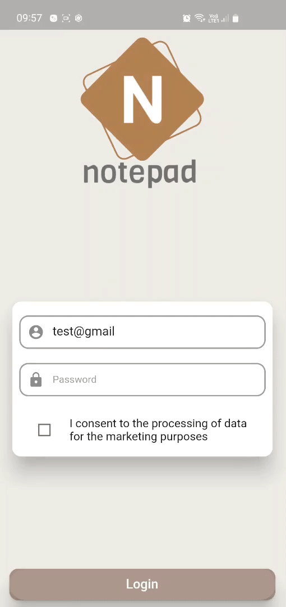
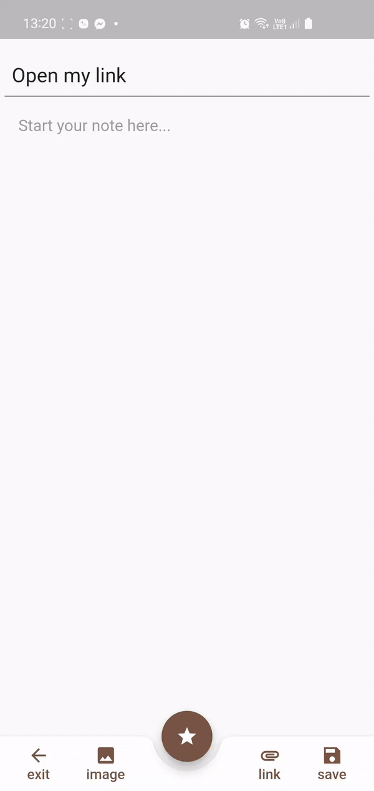
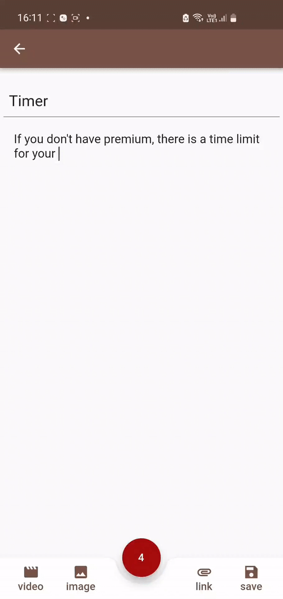

# Notepad
<h6> Flutter android app </h6>

Notepad is a simple and fast notetaking app for making notes, memos, or just any plain text content.
 
To watch full demo go to [assets/notepad_demo](https://github.com/pawuload/flutter-notepad/blob/main/assets/notepad_demo.mp4) and download the file.

## Features
- [Create an account](#create-an-account) with data storage connected to Firebase
- Make your own notes which include text, images and clickable links
- No limits on note's length or number of notes
- [Open saved links](#Webdrawer) with a built-in webdrawer
- [Get Premium](#get-premium) version to unlock useful features
- [Edit](#edit-notes) already existing notes
- [Switch](#switch-modes) between reading and editing mode
- [Upload images and videos](#upload-images-and-videos)

### Create an account
Sign in with email and password. If your account does not exist, it will be created automatically.
 
App has fully working auth error handling using Firebase Auth.

### Webdrawer
Open links in reading mode using built-in webdrawer. 

### Get Premium
Get useful Premium version with which you can edit your notes and turn off [time limit](#time-limit) for writing them.
 
You can get Premium in a few different ways. Each of them is presented below.

### Edit notes
If you have Premium version, you can easily edit text, image and link in your existing note.

### Delete notes
Delete unwanted notes with one click.  

### Switch modes
With one click switch between editing and reading mode.

### Upload images and videos 
Make your notes more interesting by adding some visual media. Watch your images and videos in scrollable [gallery](#gallery).  
You can upload up to 12 images and one video to each note. 

### Gallery
Admire your wonderful images and videos in the scrollable gallery.

### Time limit
If you are non-premium user, your time for making a single note is limmited.
 
To unlock possibility of unlimited time for making notes, get the Premium version

